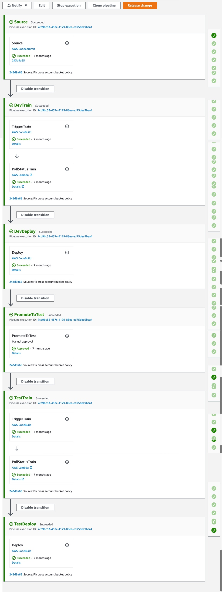

# ML Ops using AWS Fraud detector


## Basics
Lets get AWS Fraud detector up and running in a single account first using a Notebook!

This section demonstrates how to train and deploy Amazon fraud detector using Boto3.

### Prerequisites

1. Python 3.6.5 - For more details, see https://www.python.org/downloads/release/python-365/
2. Setup Virtual env - For more details, see https://docs.python.org/3.6/tutorial/venv.html 


### Local Setup
1. Once you have activated your virtual env, install dependencies in the command line

    ```bash
    
    pip install -r ./src/requirements.txt 
    pip install -r ./tests/requirements.txt
    pip install -r ./requirements_notebook.txt

    ```
    
2. To check if the install & setup works, run the tests in the command line
  
    ```bash
    
    export PYTHONPATH=./src
    pytest 
    
    ```
 

### Run

See sample code in notebook [ReadmeFraudDetector.ipynb](ReadmeFraudDetector.ipynb). To run on the cli see samples below


### Data Transformation

1. The scaffolding for data transformation code is in [src/main_demo_data_transformer.py](src/main_demo_data_transformer.py). To run transformation with sample data

```bash 
export PYTHONPATH=./src
# get help
python ./src/main_demo_data_transformer.py -h

# sample run
python ./src/main_demo_data_transformer.py --s3desturi s3://mybucket/fraud-demo/
```

### Training

1. The scaffolding for training code is in [src/main_demo_fraud_detector_train.py](src/main_demo_fraud_detector_train.py). To run training with sample data that we created using the transformation step above. 
**Note:** A prerequisite is the the roles need to be set up for Fraud detector to run. See [infra/README.md](infra/README.md) on how to set deploy fraud detector role


```bash 
export PYTHONPATH=./src
# get help
python ./src/main_demo_fraud_detector_train.py -h

# sample run
python ./src/main_demo_fraud_detector_train.py --s3uri s3://mybucket/fraud-demo/train.csv --role <roleArnAssumedByFraudDetectorToAccessS3data> --sampledata "<sample_training_data>"
```

### Deploy Model

1. The scaffolding for deployment code is in [src/main_demo_fraud_detector_deploy.py](src/main_demo_fraud_detector_deploy.py). To run deploy the model that we created using the training step above

```bash 
export PYTHONPATH=./src
# get help
python ./src/main_demo_fraud_detector_deploy.py -h

# sample run
python ./src/main_demo_fraud_detector_deploy.py --model sample_model_name --modelVersion 1.0 --detector demo
```


### UnDeploy Model

1. The scaffolding for undeployment code is in [src/main_demo_fraud_detector_undeploy.py](src/main_demo_fraud_detector_undeploy.py). To undeploy a model sample_model_name, version 1.0 and detector demo

```bash 
export PYTHONPATH=./src
# get help
python ./src/main_demo_fraud_detector_undeploy.py -h

# sample run
python ./src/main_demo_fraud_detector_undeploy.py --model sample_model_name --modelVersion 1.0 --detector demo

```


## MLOps and Multiaccount deployment using CDK

To create a multi-account Codepipeline workflow to deploy Fraud Detector, See [./infra/README.md](./infra/README.md)




#### Useful resources

-  [AWS Fraud Detector github samples](https://github.com/aws-samples/aws-fraud-detector-samples/blob/master/Fraud%20Detector%20End%20to%20End/Fraud_Detector_End_to_End.ipynb)


## Security

See [CONTRIBUTING](CONTRIBUTING.md#security-issue-notifications) for more information.

## License

This library is licensed under the MIT-0 License. See the [LICENSE](LICENSE) file.

