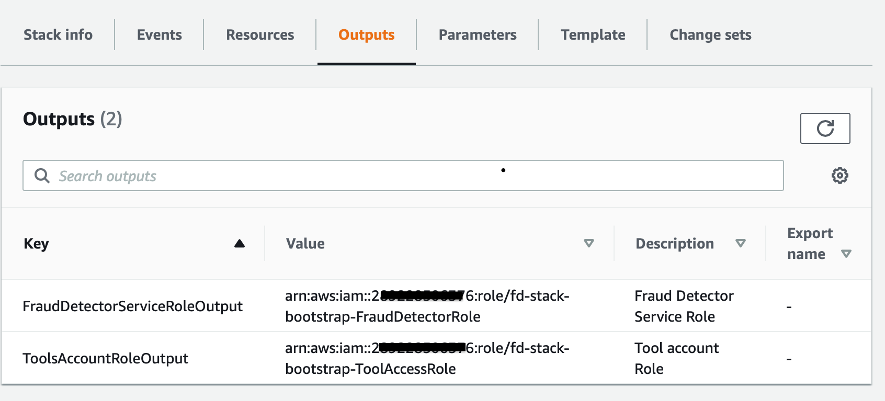

# MLOps pipeline for Amazon Fraud Detector


## Prerequisites

1. Install AWS CDK cli, for more details see AWS documentation https://docs.aws.amazon.com/cdk/latest/guide/work-with-cdk-python.html

    *  Install Node.js
    * `npm install -g aws-cdk@^1.38.0`

2. Python

    *  Python 3.6 https://www.python.org/downloads/release/python-365/
    *  Set up virtual env, see https://docs.python.org/3/tutorial/venv.html


## Set up

```
$ pip install -r infra/requirements.txt
```

## To create the Cloudformation templates

To design the pipeline customising the number of environments, approval etc, configure it using a json as shown in [infra/src/app_default_design_config.json](./src/app_default_design_config.json). You can add more environments as you like, such sit & prod. The config below, trains & deploys models from **dev-->test**
    
```bash

export PYTHONPATH=infra/src
cdk --app "python ./infra/src/app.py --configfile ./infra/src/app_default_design_config.json" synth
``` 
    
This will create cloud formation templates in a directory `cdk.out`

### Multi account deployment
    
1. To create CFN for the  full set of stacks for multi account deployment. The parameters to deploy the CFN are defined in the sample json [../build/ml_pipeline_config.sample.json](../build/ml_pipeline_config.sample.json). You can customise this according to your needs. The main section you would need to usually change is the `variables` section.

    ```bash
    export PYTHONPATH=infra/src
    cdk --app "python ./infra/src/app.py --configfile  build/ml_pipeline_config.sample.json" synth
    ```


## Deploy the stack using CloudFormation

If you do not have admin rights, then you can synthesize the cloudformation template and give the template to the AWS Administrator within your organisation to deploy the stacks.

### Preparation
    
   - Decide on the bucket name, e.g. `frauddetector-bucket`
   - Decide on the AWS accounts that fraud detector will run in , e.g `Dev AWS account -> Test Account -> Prod Account`
   - Decide on the tools account, the AWS  account in which the ML Ops pipeline runs in. This code pipeline will switch role from this account into the target environment account , e.g. dev, test etc

### Step 1: Set up permissions on each target enviornment
1.  Run the `<prefix>-S1EnvironmentBootstrap.template.json` , which is created in CDK.out folder, for each account (e.g. dev, test, prod etc) you want to deploy fraud detector in. 
    
    **Note** The bucket you specify here, is used to create read access permission, but the bucket itself will be created in Step 2
    
    
    
    To deploy using CDK, say to environment pointed to by say `devprofile`
    
    ```bash
         export PYTHONPATH=./infra
         python ./infra/src/app_deploy_config.py --configfile build/ml_pipeline_config.sample.json --stacktype  S1EnvironmentBootstrap --profile devprofile
    ```
    
2. Once the stack is deployed, make a note of the output parameters which contain the 2 roles, `FraudDetectorRole and Tools Account Role`, that is created in each environment 
    
    
    


### Step 2: Create Fraud detector data bucket
 
In this step, we create a bucket that has bucket policies that allows cross account read access from each of the enviornment specific FraudDetectorRole, that we created in step1, has access to read the data.

1. Deploy the cfn template `<prefix>-S2Data.template.json` where you specify 
    
    - the bucket to create ( which must match the one in step 1) 
    - the csv list of FraudDetectorRoles for each of the environment you previously deployed the stack in step 1.

    
    
   To deploy using CDK
    
    ```bash
        export PYTHONPATH=./infra
   
        python ./infra/src/app_deploy_config.py --configfile build/ml_pipeline_config.sample.json --stacktype  S2Data --profile mlopstest
    ```
    
    
### Step 3: Create the ML pipeline in the tools account

   First run CDK Bootstrap. This is a one - off task 
   
   ```bash
        # Run CDK bootstrap. You need admin rights
        cdk bootstrap aws://1111/us-east-2 
   ```

   ```bash

        
        export PYTHONPATH=./infra
   
        python ./infra/src/app_deploy_config.py --configfile build/ml_pipeline_config.sample.json --stacktype  S3MLPipeline --profile mlopstools
   ```

If everything works, you will see a pipeline similar to the one here

 
